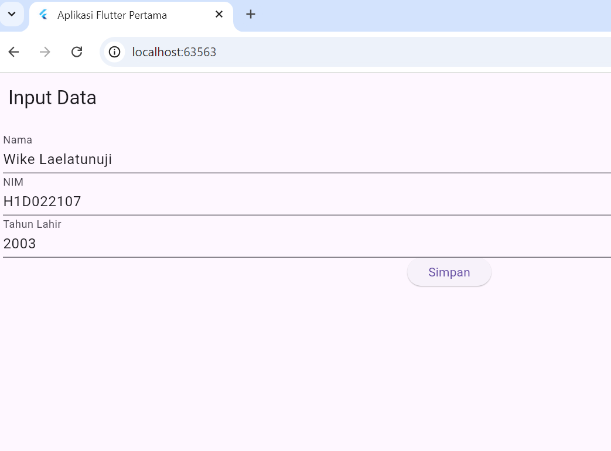
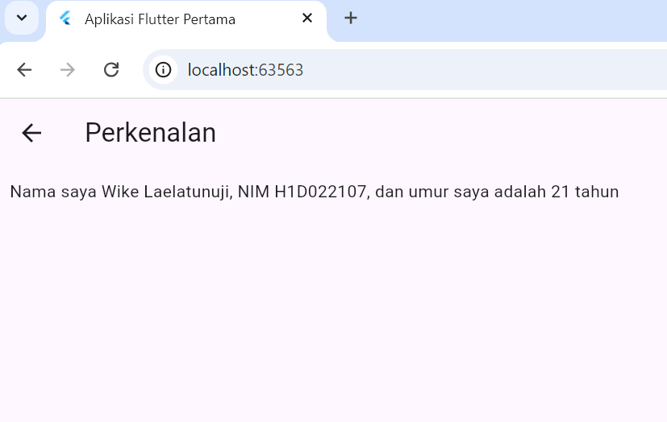

# Tugas Pertemuan 2
Nama: Wike Laelatunuji
NIM: H1D022107
Shift baru: C

Penjelasan tentang proses passing data dari form menuju tampilan di Flutter 

1. Input Data di Form (Widget FormData):
   - Di dalam widget FormData, pengguna memasukkan Nama, NIM, dan Tahun Lahir melalui input teks (TextField).
   - Setiap input ini disimpan menggunakan TextEditingController yang menangani teks pada masing-masing field, yaitu: _namaController untuk Nama, _nimController untuk NIM, dan _tahunController untuk Tahun Lahir.

 2. Saat Data Disimpan:
   - Ketika pengguna menekan tombol Simpan (didefinisikan di metode _tombolSimpan()), data yang diinput diambil dari masing-masing TextEditingController. Contohnya:
     - String nama = _namaController.text; untuk mengambil Nama,
     - String nim = _nimController.text; untuk mengambil NIM,
     - int tahun = int.parse(_tahunController.text); untuk mengambil dan mengonversi Tahun Lahir menjadi tipe integer.

 3. Navigasi ke Halaman TampilData:
   - Setelah data diambil, aplikasi akan menavigasi ke halaman baru (TampilData) menggunakan Navigator.of(context).push() dan MaterialPageRoute. Ini adalah cara Flutter untuk berpindah dari satu halaman ke halaman lain.
   - Saat navigasi dilakukan, data Nama, NIM, dan Tahun Lahir dilewatkan ke widget TampilData sebagai parameter:
     Navigator.of(context).push(
       MaterialPageRoute(
         builder: (context) => TampilData(nama: nama, nim: nim, tahun: tahun),
       ),
     );

 4. Menampilkan Data di Widget TampilData:
   - Di halaman TampilData, data yang dilewatkan dari FormData diterima di dalam konstruktor TampilData. Misalnya:
       const TampilData({
       required this.nama,
       required this.nim,
       required this.tahun,
     });
     
   - Data tersebut kemudian digunakan untuk menampilkan informasi di layar, termasuk perhitungan usia berdasarkan tahun lahir:
     final int umur = DateTime.now().year - tahun;
     
   - Hasil akhirnya ditampilkan di dalam widget Text di halaman TampilData:
     Text("Nama saya $nama, NIM $nim, dan umur saya adalah $umur tahun")
     

 Ringkasan:
1. Pengguna memasukkan data di FormData.
2. Ketika tombol Simpan ditekan, data diambil dari TextEditingController.
3. Data tersebut dilewatkan ke halaman TampilData melalui Navigator dan MaterialPageRoute.
4. Di halaman TampilData, data ditampilkan dan usia dihitung dari tahun lahir.

## Screenshot
Hasil :

